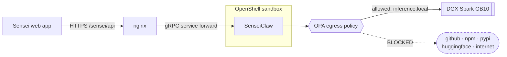

<h1 align="center">SenseiClaw</h1>
<p align="center"><strong>The AI tutor harness behind <a href="https://github.com/brishtiteveja/Sensei">Sensei</a>.</strong></p>
<p align="center">Reads a student's handwritten working, finds the step where they slipped, and asks the question that gets them to it — without ever handing over the answer.</p>

<p align="center">
  
  
  
</p>

---

Sensei is a Socratic tutor for maths and science, multilingual across 8 locales,
whose tutoring model runs locally on an **NVIDIA DGX Spark (GB10)**. This repo is
its brain: the HTTP service that owns model routing, the pedagogy prompts, the
two-stage vision pipeline, and the observation store.

The **web app** — the thing a student actually looks at — lives in
[`brishtiteveja/Sensei`](https://github.com/brishtiteveja/Sensei). It talks to
this service and nothing else.

Because students are minors, the design constraint is not a nice-to-have: a
child's handwriting, mistakes, and weak spots stay on the box. Pull the network
cable and it keeps teaching.

## The idea: two stages, never one

The core endpoint is `POST /tutor/coach`.

```
stage 1   image ──▶ VISION model @ 0.2 ──▶ raw reading
                    "line 2: negative not distributed"
                              │
stage 2   reading ──▶ TEXT-ONLY model @ 0.6 ──▶ {status, hint, question, focus}
          (never sees pixels)
```

**Why it must be split.** One prompt asking a model to read handwriting *and*
teach from it does neither well: it transcribes and forgets to teach, or it
teaches and invents lines that are not on the page. Split, each stage gets its
own temperature — and stage 2, being text-only, can run on a different model
entirely. `reading_model` and `coaching_model` are per-request overrides, so the
split is a config flip rather than new code.

Measured end to end on a real handwritten page:

| Configuration | Time |
|---|---|
| both stages local (`qwen3-vl-30b-a3b-gguf`) | 8.3 s |
| local eyes + `gemini-3.5-flash` teaching | 6.4 s |

Sample output — hint: *"Watch out for the negative sign when you expand the
parentheses."* question: *"What does the −4 inside the parentheses become when you
distribute the negative sign?"* It never states the fix.

## The constraint that shapes everything

The vllm router keeps **exactly one model resident**. Asking for a different one
triggers a cold swap of **1–5 minutes**, served on the same HTTP call.

So "a vision model for handwriting plus a separate tutor model, both local" is a
design that cold-swaps on every single interaction — measured at 2m17s and
thrashing. Sensei instead pins **one** vision-capable multilingual model locally
and pushes the other stage to the cloud when it wants a second brain. Check what
is actually hot before demoing:

```bash
curl -s https://spark-e257.tail803c7f.ts.net:8443/health   # {"loaded":["..."]}
curl -s http://127.0.0.1:4050/admin/models                 # what this service is set to
```

Reasoning models return `content: null` with the answer in `reasoning`; the
client falls back to it, and sends `chat_template_kwargs.enable_thinking=false`
for local models so stage 2 emits clean JSON.

## API

| Route | Purpose |
|---|---|
| `POST /tutor/coach` | both stages — the core loop |
| `POST /tutor/see` | stage 1 only; chat attachments and session replay |
| `POST /tutor/stream` | streaming Socratic chat |
| `POST /tutor/hint` · `/explain` · `/query` | targeted single-turn help |
| `GET /tutor/health` | `{"status":"ok","engines":N}` — **not** `/health` |
| `POST /grade` | teacher-side marking of submitted work against a rubric |
| `GET /curriculum/*` | subjects, lessons, tracks, exams, regions, plans |
| `POST /curriculum/translate` | curriculum text into the student's language |
| `GET /practice/questions` · `/practice/subjects` | past-exam MCQs |
| `POST /observe` · `/observe/attempt` | event stream + one-row attempt summaries |
| `GET /handoff/{code}` | phone-to-desktop pairing relay |
| `GET`/`POST` `/admin/model` · `/admin/models` | runtime model switching |

## Where it runs

In production this service runs **inside a NemoClaw / OpenShell sandbox** —
Landlock + seccomp + a network namespace with an OPA egress proxy in front of
it. It binds the sandbox's own loopback and is bridged out to nginx by an
OpenShell gRPC service forward, so nothing is published from the container.



`SENSEI_LOCAL_BASE_URL=https://inference.local/v1` is the whole trick: inference
goes through the policy-enforced route rather than straight out. Verified —
`inference.local` returns the genuine `owned_by: "dgx-spark"` catalogue while
`github.com`, `pypi.org`, `registry.npmjs.org`, `huggingface.co` and
`raw.githubusercontent.com` all fail closed, and a real `/tutor/query` still
answers correctly in ~14 s.

Setup, the traps, and the start scripts live in
[NEMOCLAW.md](https://github.com/brishtiteveja/Sensei/blob/main/others/hackathon/sensei/NEMOCLAW.md).

## Running locally

```bash
uv sync
.venv/bin/uvicorn clawpy.server:app --host 127.0.0.1 --port 4050
```

| Env | Default | Notes |
|---|---|---|
| `SENSEI_BASE_URL` | `http://localhost:8010/v1` | vllm router base URL |
| `SENSEI_API_KEY` | — | bearer token, if the router wants one |
| `SENSEI_MODEL` | `qwen3-vl-30b-a3b-gguf` | the pin — changing it is an architectural decision |
| `SENSEI_TIMEOUT` | `900` | must exceed worst-case cold swap |
| `SENSEI_OFFLINE` | `1` | hard-fails any off-box request; set `0` only for remote dev |
| `GEMINI_API_KEY` | — | cloud stage-2 teaching and teacher-side grading |

## Lineage

Forked from **ClawPy**, a multi-provider Python coding agent, and repurposed into
a tutoring harness — which is why the package is still `clawpy`, and why the
provider/engine/session layers are more general than a tutor strictly needs. That
generality is the part that earned its keep: it is what lets one `/tutor/coach`
call put local vision and cloud pedagogy in the same request.

History was squashed on 16 Aug 2026 so the repo starts at the hackathon; the
inherited codebase is a single `Initial import` commit.

## Related

- [`brishtiteveja/Sensei`](https://github.com/brishtiteveja/Sensei) — web app, mobile app, curriculum, samples, docs
- `others/hackathon/sensei/HANDOFF.md` in that repo — current build state, what is verified, what is risky
